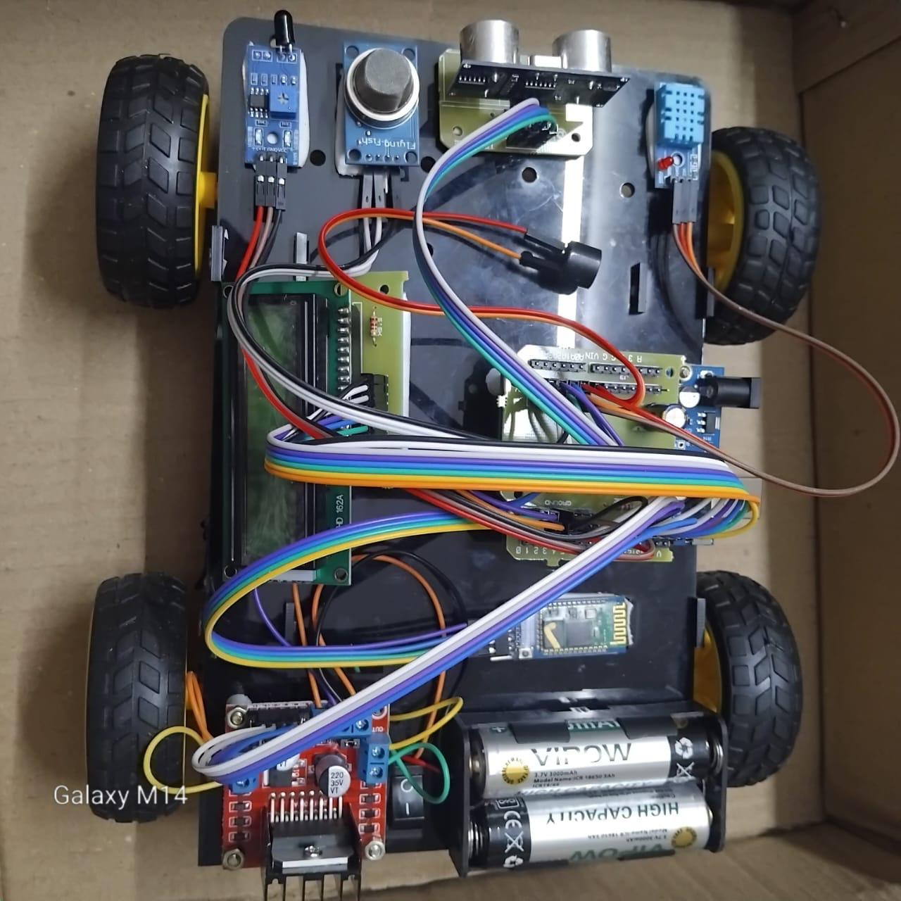
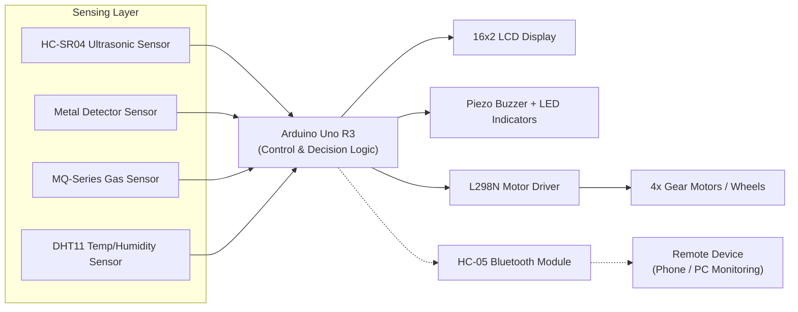
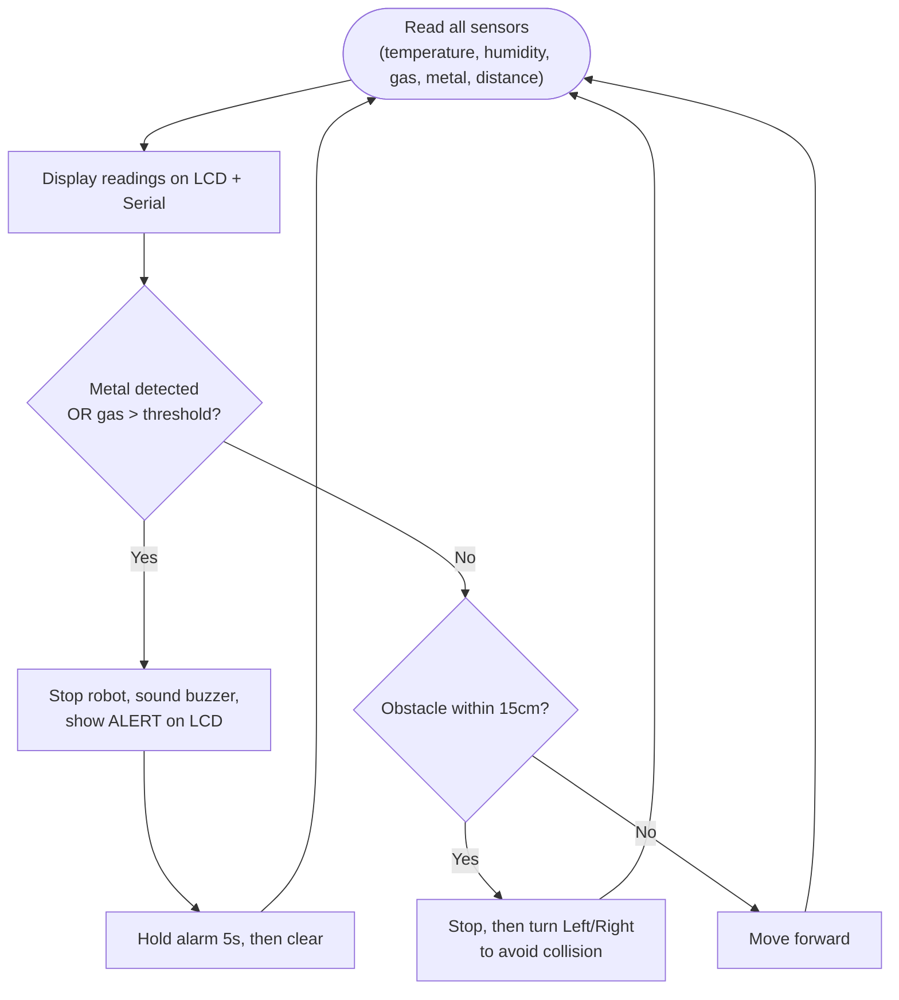

# Border Eye

### Real-Time Intrusion Detection System using Arduino

<p align="center">
  
</p>
<p align="center">
  <sub><i>Assembled Border Eye prototype — Arduino Uno, dual ultrasonic sensors, metal sensor, gas sensor, DHT11, 16×2 LCD, HC‑05 Bluetooth module and a 4‑wheel motor‑driven chassis.</i></sub>
</p>

---

## Table of Contents

1. [Abstract](#abstract)
2. [Introduction](#introduction)
3. [Problem Statement](#problem-statement)
4. [Existing Systems and Their Limitations](#existing-systems-and-their-limitations)
5. [Proposed System](#proposed-system)
6. [System Architecture](#system-architecture)
7. [Hardware Components](#hardware-components)
8. [Pin Configuration](#pin-configuration)
9. [Firmware / Working Logic](#firmware--working-logic)
10. [Operation Flow](#operation-flow)
11. [Bill of Materials / Cost Estimation](#bill-of-materials--cost-estimation)
12. [Applications](#applications)
13. [Advantages](#advantages)
14. [Testing and Results](#testing-and-results)
15. [Development Timeline](#development-timeline)
16. [Deployment Guidelines](#deployment-guidelines)
17. [Future Scope](#future-scope)
18. [Conclusion](#conclusion)
19. [Author](#author)

---

## Abstract

Border security is a critical aspect of national safety, requiring continuous monitoring to prevent illegal crossings, smuggling, and infiltration attempts. **Border Eye** is a multi‑sensor, real‑time security system built around an Arduino Uno that is capable of detecting several classes of threats at once — concealed metallic weapons, harmful/explosive gases, sudden environmental changes, and physical intrusion — from a single, compact, mobile platform.

The system fuses four sensing modalities — an ultrasonic sensor for motion/distance, a metal sensor for concealed metallic objects, a gas sensor for toxic or explosive vapors, and a DHT11 sensor for temperature and humidity — into one Arduino‑controlled unit. Sensor data is processed continuously; whenever a threat condition is crossed, the system halts, raises a local buzzer/LED alarm, and displays the exact cause on an onboard LCD, giving security personnel comprehensive situational awareness while reducing manual workload. Because it is built entirely from low‑cost, off‑the‑shelf modules, the platform is inexpensive, portable, and adaptable to a wide range of terrains — making it practical for national borders, military installations, restricted industrial zones, and other high‑security perimeters.

## Introduction

Borders are not merely geographical lines — they represent the security and sovereignty of a nation. Traditional border security has long relied on human patrolling and stationary cameras, both of which are constrained by coverage area, reaction speed, and environmental adaptability. With growing threats such as terrorism, illegal immigration, and smuggling, there is a clear need for smart, automated surveillance systems capable of real‑time alerts and accurate threat classification.

Border Eye addresses this gap by combining Arduino‑based control logic with a suite of environmental and security sensors mounted on a mobile, four‑wheeled chassis:

- The **ultrasonic sensor** detects movement and obstacles in restricted zones.
- The **metal sensor** identifies the presence of metallic weapons or contraband.
- The **gas sensor** flags toxic or explosive gases in the vicinity.
- The **DHT11 sensor** records environmental changes that could indicate tampering or unusual activity.

Together these enable continuous, 24/7 monitoring, reduce dependence on manual patrols, and allow a rapid response to security breaches. The modular design means Border Eye can be deployed in remote locations with minimal supporting infrastructure.

## Problem Statement

Border security forces are tasked with monitoring vast, often remote areas for unauthorized intrusions and hazardous threats. Human‑based surveillance is labor‑intensive, prone to fatigue, and significantly limited at night or in harsh weather. Most existing solutions also lack integrated environmental hazard detection and frequently require expensive supporting infrastructure.

**Key gaps identified:**

| Gap | Description |
|---|---|
| Intrusion Detection | Lack of real‑time alerts when intruders approach or cross a boundary. |
| Smuggling Risk | Limited ability to detect concealed metallic weapons or objects. |
| Environmental Hazards | No integrated system for detecting harmful gases or explosive vapors nearby. |
| Manual Dependency | Excessive reliance on human patrols — costly and inconsistent. |
| Coverage Limitations | Difficulty monitoring remote or inaccessible border regions. |

Border Eye was conceived to close these gaps with a **low‑cost, multi‑sensor system** that provides comprehensive, real‑time monitoring for both intrusion and environmental threats.

## Existing Systems and Their Limitations

| Approach | How it works | Limitations |
|---|---|---|
| Manual Patrols | Personnel physically monitor border areas | Time‑consuming, labor‑intensive, prone to fatigue |
| CCTV Surveillance | Cameras provide continuous video coverage | Needs constant human monitoring; limited by weather, blind spots, and night visibility |
| Single‑Sensor Alarms | Basic motion detectors / IR beams | Frequent false alarms from animals, weather, or environmental noise |
| Radar / Thermal Imaging | High‑end dedicated systems | Expensive, needs skilled operators, impractical for wide/rural deployment |

Common shortcomings across all of the above: no multi‑sensor fusion (so only one threat type is ever covered), high operational cost, frequent false positives, limited coverage in rugged terrain, and no built‑in environmental hazard detection.

## Proposed System

Border Eye proposes a **low‑cost, multi‑sensor, Arduino‑based** solution for real‑time intrusion and hazard detection that directly answers the gaps above:

- **Ultrasonic Sensor (HC‑SR04)** — detects motion and measures the distance of intruders/obstacles.
- **Metal Sensor** — identifies concealed metallic weapons or contraband.
- **Gas Sensor (MQ‑series)** — detects harmful or explosive gases.
- **DHT11 Sensor** — monitors temperature and humidity for anomalies.
- **Arduino Uno Microcontroller** — reads every sensor, applies threshold logic, and drives the alerting and mobility hardware.
- **Buzzer & LED Indicators** — provide an immediate, local audible/visual alarm.
- **16×2 LCD Display** — shows live sensor readings and alert status on-site.
- **HC‑05 Bluetooth Module** — enables wireless data monitoring from a nearby device.
- **4WD Motorized Chassis (L298N driver + gear motors)** — lets the unit patrol and reposition rather than sit fixed in one spot.

## System Architecture

All sensors feed into a single Arduino Uno, which evaluates their readings against pre‑defined thresholds and drives the buzzer, LCD, and drive motors accordingly.



This centralizes all decision‑making in the microcontroller: sensor data flows in, threat logic runs continuously, and alerts/motion commands flow out to the buzzer, LCD, and motors.

## Hardware Components

| Component | Role in the System | Why it was chosen |
|---|---|---|
| **Arduino Uno R3** | Central microcontroller — reads all sensors, runs the monitoring logic, drives outputs | Affordable, versatile, wide sensor/library compatibility |
| **HC‑SR04 Ultrasonic Sensor** | Detects motion and measures intruder/obstacle distance | Good precision and range (several meters), works well even in low light |
| **Metal Detector Sensor** | Scans for concealed metallic weapons or contraband | Reliable metal detection with simple digital Arduino interfacing |
| **MQ‑Series Gas Sensor** | Detects toxic or explosive gases (e.g. methane, LPG, smoke) | Fast, reliable response; guards against environmental hazards and sabotage |
| **DHT11 Sensor** | Monitors temperature and humidity for abnormal changes | Simple, low‑cost early‑warning for tampering or unusual conditions |
| **16×2 LCD Display** | Shows live temperature, humidity, gas, distance, and metal readings on-site | Immediate local readout without needing a separate device |
| **Piezo Buzzer + High‑Brightness LEDs** | Sound + visual alarm on threat detection | Rapid, unmistakable alert for personnel nearby |
| **HC‑05 Bluetooth Module** | Wireless link for remote status monitoring | Enables monitoring beyond direct line of sight |
| **L298N Motor Driver** | Drives the four gear motors from Arduino digital outputs | Standard, robust dual H‑bridge driver for small robotic platforms |
| **4x 12V Gear Motors + Wheels** | Provide mobility across the patrol area | Lets the unit patrol/reposition instead of being fixed in place |
| **2x 18650 Li‑ion Batteries (3.7V, 3000mAh)** | Power supply for the platform | Rechargeable, compact, sufficient capacity for field operation |
| **Jumper Wires, Connectors, Enclosure** | Wiring and physical protection | Secure, modular connections; weatherproofing for outdoor reliability |

## Pin Configuration

| Arduino Pin | Connected To | Function |
|---|---|---|
| 8, 9, 10, 11, 12, 13 | 16×2 LCD (RS, E, D4–D7) | Local sensor/status display |
| A0 | DHT11 | Temperature & humidity data |
| A1 | HC‑SR04 `TRIG` | Ultrasonic trigger pulse |
| A2 | HC‑SR04 `ECHO` | Ultrasonic echo pulse |
| A3 | Gas Sensor (analog out) | Gas concentration reading |
| 2 | Metal Sensor | Digital metal‑presence signal |
| 7 | Buzzer | Audible alarm output |
| 6, 5, 4, 3 | L298N Motor Driver (M1–M4) | Drive‑motor direction control |

## Firmware / Working Logic

The Arduino sketch is organized into clear, modular sections — sensor initialization, continuous data collection, threat/obstacle decision logic, and motor control helpers.

**Includes & pin definitions**
```cpp
#include <LiquidCrystal.h>   // LCD library
#include <DHT.h>             // Temperature / humidity sensor

LiquidCrystal lcd(8, 9, 10, 11, 12, 13);
#define DHTPIN  A0
#define GAS     A3
#define TRIG    A1
#define ECHO    A2
#define METAL   2
#define BUZZER  7
#define M1 6
#define M2 5
#define M3 4
#define M4 3
```

**Setup — initializes every peripheral and shows a startup message**
```cpp
void setup() {
  Serial.begin(9600);
  lcd.begin(16, 2);
  dht.begin();
  // pinMode configuration for sensors, buzzer, and motor pins
  lcd.print("Smart Robot");
  delay(1500);
  lcd.clear();
}
```

**Main loop — reads every sensor on each cycle**
```cpp
void loop() {
  temperature = dht.readTemperature();
  humidity    = dht.readHumidity();
  gasValue    = analogRead(GAS);
  metalValue  = digitalRead(METAL);
  distance    = getDistance();
  ...
}
```

**Live readout on LCD + Serial monitor** — every cycle prints temperature, humidity, gas level, distance, and metal status both to the on‑board LCD and over serial, so the same data is visible locally and to a connected PC.

**Threat detection (hazard branch)** — if a metallic object or an elevated gas reading is sensed, the platform halts and raises a five‑second local alarm before resuming monitoring:
```cpp
if (metalValue == 0 || gasValue > 450) {
  stopRobot();
  digitalWrite(BUZZER, HIGH);
  lcd.clear();
  lcd.print("ALERT! Hazard!");
  lcd.setCursor(0, 1);
  if (metalValue == HIGH) lcd.print("Metal Detected");
  else lcd.print("Gas Detected");
  delay(5000);
  digitalWrite(BUZZER, LOW);
  lcd.clear();
}
```

**Obstacle avoidance branch** — if nothing hazardous is detected but an object is within 15 cm, the platform stops and turns instead of colliding:
```cpp
else if (distance <= 15) {
  stopRobot();
  lcd.clear();
  lcd.print("Obstacle Ahead");
  lcd.setCursor(0, 1);
  lcd.print("Turning...");
  delay(500);
  if (random(0, 2) == 0) turnLeft();
  else turnRight();
  delay(1000);
} else {
  moveForward();
}
```

**Ultrasonic distance measurement helper**
```cpp
int getDistance() {
  digitalWrite(TRIG, LOW);
  delayMicroseconds(2);
  digitalWrite(TRIG, HIGH);
  delayMicroseconds(10);
  digitalWrite(TRIG, LOW);
  duration = pulseIn(ECHO, HIGH, 30000);
  int dist = duration * 0.034 / 2;
  return dist;
}
```

**Motor control helpers** — modular functions covering every drive state:
```cpp
void moveForward() {
  digitalWrite(M1, HIGH); digitalWrite(M2, LOW);
  digitalWrite(M3, HIGH); digitalWrite(M4, LOW);
}
void turnLeft() {
  digitalWrite(M1, LOW);  digitalWrite(M2, HIGH);
  digitalWrite(M3, HIGH); digitalWrite(M4, LOW);
}
void turnRight() {
  digitalWrite(M1, HIGH); digitalWrite(M2, LOW);
  digitalWrite(M3, LOW);  digitalWrite(M4, HIGH);
}
void stopRobot() {
  digitalWrite(M1, LOW); digitalWrite(M2, LOW);
  digitalWrite(M3, LOW); digitalWrite(M4, LOW);
}
```

## Operation Flow



## Bill of Materials / Cost Estimation

The original design budget (per the project's cost‑estimation sheet):

| Item | Approx. Cost (INR) |
|---|---:|
| Arduino Uno | ₹550 |
| DHT11 Sensor | ₹150 |
| Gas Sensor | ₹200 |
| Metal Sensor | ₹250 |
| 12V Gear Motors | ₹450 |
| Dummy Motors | ₹150 |
| Wheels (7×2) | ₹200 |
| Jumper Wires & Miscellaneous | ₹1,000 |
| **Estimated Total** | **≈ ₹2,950** |

> The final assembled prototype (see photo above) also adds a 16×2 LCD, an HC‑05 Bluetooth module, an L298N motor driver, a piezo buzzer with LED indicators, and two 18650 Li‑ion cells — these refine the original estimate above and should be priced in for an accurate total build cost.

## Applications

- **National Border Surveillance** — detects unauthorized entry attempts.
- **Military Base Security** — monitors restricted areas for movement or weapons.
- **Industrial Plant Security** — identifies intrusions and hazardous gas leaks.
- **Prison Perimeter Monitoring** — detects escape attempts or contraband smuggling.
- **Airport Runway / Fence Security** — guards against unauthorized access to sensitive zones.
- **Critical Infrastructure Protection** — safeguards power plants, dams, and research facilities.

## Advantages

- **Real‑Time Monitoring** — instant detection of intrusion and hazardous conditions.
- **Multi‑Threat Detection** — combines motion, metal, gas, and environmental sensing in one unit.
- **Cost‑Effective** — built entirely from affordable Arduino‑ecosystem components.
- **Easy Deployment** — portable and adaptable to varied terrains and weather.
- **Reduced Human Risk** — minimizes the need for personnel to patrol dangerous areas.
- **Scalable** — can be extended with more sensors or additional wireless communication.
- **Low Power Consumption** — suitable for battery or solar‑powered remote installations.

## Testing and Results

The prototype was validated against real‑world stimuli for each sensing modality:

| Test Scenario | Trigger | Result |
|---|---|---|
| Person walking in front of the ultrasonic sensor | Motion / proximity | Motion correctly detected |
| Metal object placed near the metal sensor | Concealed metal | Hazard alert correctly triggered |
| Release of test gas near the gas sensor | Gas leak simulation | Gas alarm correctly triggered |
| Simulated temperature spike | Abnormal climate change | Climate warning correctly triggered |

The system responded quickly and reliably across all four scenarios with minimal false alarms, confirming successful integration of the sensing, alerting, and mobility subsystems.

## Development Timeline

| Week | Milestone |
|---|---|
| 1 | Research & Planning — study border security requirements, select sensors and Arduino model |
| 2 | Hardware Procurement — sensors, Arduino board, buzzer, power supply, mounting materials |
| 3 | Individual Sensor Testing — metal, gas, DHT11, and ultrasonic sensors tested independently |
| 4 | Arduino Integration — sensors wired to Arduino, data processing verified |
| 5 | Alert Mechanism Implementation — buzzer and LED indicators integrated for real‑time alerts |
| 6 | Field Testing — system deployed in a test area and evaluated under different conditions |
| 7 | Optimization — sensor thresholds fine‑tuned, accuracy improved |
| 8 | Documentation & Final Presentation — project report, slides, and live demo prepared |

## Deployment Guidelines

- Calibrate every sensor accurately before deployment.
- Maintain secure wiring and a weatherproof housing for outdoor use.
- Keep firmware modular so new sensors can be integrated with minimal changes.
- Implement fail‑safe mechanisms to handle false alarms gracefully.
- Perform regular maintenance checks on all hardware.
- Test the system across varied weather conditions to confirm reliability.
- Log and analyze sensor readings over time for pattern recognition and future tuning.
- Favor a low‑power design for unattended, remote‑area deployment.

## Future Scope

Building on the "Scalable" design goal above, natural next steps include:

- Adding GSM/IoT connectivity (beyond the current Bluetooth link) for true remote alerting over long distances.
- Integrating a camera module for visual confirmation of detected threats.
- Solar charging for fully unattended, long‑duration field deployment.
- On‑device or cloud‑side data logging with pattern analysis to further cut false alarms.
- GPS tagging of alerts for precise incident location on larger perimeters.

## Conclusion

Border Eye demonstrates that advanced, affordable sensor technologies can be combined into a single, coherent platform for real‑time intrusion and hazard detection in border and high‑security environments. Through careful selection and integration of each hardware component — ultrasonic, metal, gas, and environmental sensing, tied together by an Arduino Uno and a mobile chassis — the system achieves reliable performance, straightforward deployment, and strong adaptability to future requirements. By leveraging the flexibility of Arduino and the precision of multiple sensors, this project shows how accessible technology can meaningfully address national and industrial security challenges.

## Author

**Dharmi Sapariya**

---

<p align="center"><sub>Border Eye — Real-Time Intrusion Detection System using Arduino</sub></p>
